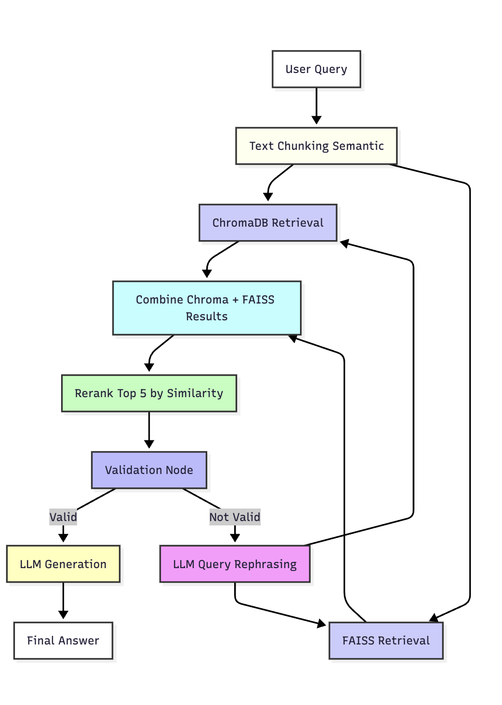

# Medicare RAG Project

This project is a Retrieval-Augmented Generation (RAG) system for answering Medicare-related questions using a PDF document as the knowledge base. It uses FastAPI, hybrid vector search (ChromaDB + FAISS), and an LLM (Ollama/llama2:7b) for answer generation.

## Recommended System Requirements

- **Operating System:** macOS, Linux, or Windows 10/11 (64-bit)
- **CPU:** Modern multi-core processor (Intel i5/Ryzen 5 or better recommended)
- **RAM:** 8 GB minimum (16 GB recommended for large PDFs or LLMs)
- **Disk Space:** At least 5 GB free (for dependencies, vector DBs, and models)
- **Python:** Version 3.11 (recommended)
- **Internet:** Required for downloading models from Hugging Face Hub (if not already cached)
- **Optional:** Apple Silicon (M1/M2) or NVIDIA GPU for faster embedding/model inference (if supported by your LLM backend)

## RAG Pipeline Flow



## How It Works
- **User Query:** User sends a question to the FastAPI `/ask` endpoint.
- **Text Chunking (Semantic):** The PDF is split into semantic chunks (e.g., paragraphs) for efficient retrieval.
- **Embedding & Retrieval Strategies:**
  - **Dense Embeddings:** Multiple SentenceTransformer models are used to generate dense vector representations of each chunk. These include:
    - `all-MiniLM-L6-v2` (small, fast, general-purpose)
    - `all-mpnet-base-v2` (higher quality, general-purpose)
    - `paraphrase-multilingual-MiniLM-L12-v2` (multilingual support)
    Dense embeddings enable semantic search, allowing the system to find contextually relevant chunks even if the query wording differs from the document.
  - **Sparse Embeddings:** A TF-IDF vectorizer is used to create sparse vectors for all chunks. Sparse search (using cosine similarity) is effective for keyword-heavy or fact-based queries, and helps capture exact or near-exact matches.
  - **Keyword-based Search:** The system extracts important keywords from the query and directly matches them in the text chunks. This strategy is especially useful for queries with specific terminology or when dense/sparse embeddings may miss exact matches.
  - **Hybrid Retrieval:** Results from dense, sparse, and keyword-based searches are combined, deduplicated, and reranked to select the most relevant chunks for answer generation.
- **ChromaDB & FAISS Retrieval:** The query is used to retrieve relevant chunks from both ChromaDB and FAISS vector stores, leveraging the above embedding strategies.
- **Combine Results:** Results from both stores are combined.
- **Rerank:** All retrieved chunks are reranked by semantic similarity to the query; the top 5 are selected.
- **Validation Node:** Checks if the retrieved content matches the query intent. If not, the query is rephrased using the LLM and retrieval is retried (loop).
- **LLM Generation:** Once validated, the top reranked chunks are sent to the LLM to generate the answer.
- **Final Answer:** The answer is returned to the user.

## How to Run the Project

1. **Install dependencies:**
   ```bash
   pip install -r requirements.txt
   ```
2. **Start Ollama (for LLM):**
   ```bash
   ollama serve
   ollama run llama2:7b
   ```
   (Or use your preferred LLM backend.)
3. **Start the FastAPI server:**
   ```bash
   uvicorn app:app --reload
   ```
4. **Ask questions:**
   - Use the `/ask` endpoint (e.g., via Swagger UI at `http://localhost:8000/docs` or with `curl`/Postman).
5. **Example Query Using Swagger UI or Postman:**
   - You can test the `/ask` endpoint using the built-in Swagger UI at `http://localhost:8000/docs` or with Postman.
   - **Sample payload:**
     ```json
     {
       "query": "What is Some of the items and services that Original Medicare doesn’t cover ?"
     }
     ```
   - **Sample response :**
     ```json
      {
      "answer": "Some of the items and services that Original Medicare doesn't cover include: 1. Routine physical exams: Original Medicare does not cover routine physical exams. 2. Hearing aids and exams for fitting them: Original Medicare does not cover hearing aids or exams for fitting them. 3. Concierge care (also called concierge medicine, retainer-based medicine, boutique medicine, platinum practice, or direct care): Original Medicare does not cover concierge care, which refers to medical care that is paid for through an annual fee or retainer rather than through traditional fee-for-service billing. 4. Covered items or services you get from a doctor or other provider that has opted out of participating in Medicare: Original Medicare does not cover items or services received from a doctor or other provider who has opted out of participating in Medicare, except in the case of an emergency or urgent need. 5. Most dental care: Original Medicare typically does not cover most dental care, including routine cleanings, fillings, tooth extractions, or items like dentures. However, some dental services may be covered if they are closely related to a covered medical service, such as a heart valve repair or replacement. 6. Long-term care: Original Medicare and most health insurance, including Medigap, do not pay for non-medical long-term care services, such as personal care assistance, like help with everyday activities, including dressing, bathing, and using the bathroom. Non-medical long-term care services may also include home-delivered meals, adult day health care, home and community-based services, and others. You may be eligible for some of these services through Medicaid or you can choose to buy private long-term care insurance. Note: The information provided is based on the context given and may not be comprehensive or up-to-date. It is important to consult with Medicare or a healthcare professional for the most accurate and current information.",
      "source_pages": [
         9,
         44,
         56,
         57,
         75
      ],
      "confidence_score": 0.705845832824707,
      "chunk_size": 139,
      "total_chunks_used": 5
       }
       ```
   - In Swagger UI, expand the `/ask` endpoint, click "Try it out", and paste the above JSON in the request body.
   - In Postman, create a POST request to `http://localhost:8000/ask` with the above JSON as the body (set type to `application/json`).
6. **Logs:**
   - Retrievals from both ChromaDB and FAISS, reranking, validation, and LLM generation are all logged for explainability.

## Requirements & Compatibility
- **Python 3.11 is recommended.**
- The following package versions are required for compatibility:
  - `marshmallow==3.20.1` (required for `environs` and `pymilvus`)
  - `huggingface_hub==0.15.1` (required for `sentence-transformers==2.2.2`)
- If you encounter errors related to `marshmallow` or `huggingface_hub`, ensure these versions are installed (see `requirements.txt`).

### Hugging Face Token (if required)
- Some models from the Hugging Face Hub require authentication with a token (for example, if the model is gated or not fully public).
- If you see errors about authentication or permission denied when downloading models, you need a Hugging Face token.
- To get a token:
  1. Go to https://huggingface.co/settings/tokens and create a new token (with "read" access).
  2. Set the token as an environment variable before running your code:
     ```sh
     export HUGGINGFACE_HUB_TOKEN=your_token_here
     ```
     Or, use the Hugging Face CLI:
     ```sh
     huggingface-cli login
     ```
- The code and libraries will automatically use this token when accessing the Hugging Face Hub.

## Troubleshooting
- **ChromaDB Telemetry Error:**
  - You may see errors like `capture() takes 1 positional argument but 3 were given` from `chromadb.telemetry.product.posthog`. This is harmless and does not affect retrieval or results.
  - To disable ChromaDB telemetry, set the environment variable:
    ```sh
    export CHROMA_TELEMETRY_ENABLED=FALSE
    ```
    Or in Python:
    ```python
    import os
    os.environ["CHROMA_TELEMETRY_ENABLED"] = "FALSE"
    ```
- **ONNX/CoreML Warnings:**
  - On Apple Silicon, you may see warnings about CoreML not supporting certain input dimensions. These are expected and do not affect the pipeline; computation will fall back to CPU as needed.
- **General:**
  - If you see `distutils` errors on macOS, run: `brew install python-setuptools`
  - If you have issues with virtual environments, ensure you are using Python 3.11 and have activated the correct environment.

## Chunking Strategy Comparison

The table below compares different chunking strategies evaluated for this project:

| chunker   | num_chunks | avg_chunk_size | min_chunk | max_chunk | std_chunk | redundancy | overlap | unique_pages | recall@1 | recall@3 | recall@5 | recall@10 | precision@5 | f1@5 | coverage_positive | coverage_negative | coverage_multi-hop | coverage_ambiguous | coverage_adversarial | coverage_paraphrased |
|-----------|------------|----------------|-----------|-----------|-----------|------------|---------|--------------|----------|----------|----------|-----------|-------------|------|-------------------|-------------------|--------------------|--------------------|----------------------|----------------------|
| sliding   | 405        | 127.07         | 1         | 193       | 45.94     | 0.0        | 0.475   | 127          | 0.44     | 0.56     | 0.56     | 0.78      | 0.42        | 0.48 | 2/3               | 1/2               | 0/1                | 1/1                | 0/1                  | 1/1                  |
| semantic  | 127        | 370.17         | 2         | 554       | 106.58    | 0.0        | 0.413   | 127          | 0.44     | 0.56     | 0.89     | 0.89      | 0.64        | 0.71 | 3/3               | 1/2               | 1/1                | 1/1                | 1/1                  | 1/1                  |
| hybrid    | 532        | 185.1          | 1         | 554       | 122.71    | 0.008      | 0.979   | 127          | 0.44     | 0.56     | 0.56     | 0.78      | 0.42        | 0.48 | 2/3               | 1/2               | 0/1                | 1/1                | 0/1                  | 1/1                  |
| current   | 127        | 370.17         | 2         | 554       | 106.58    | 0.0        | 0.413   | 127          | 0.44     | 0.56     | 0.89     | 0.89      | 0.64        | 0.71 | 3/3               | 1/2               | 1/1                | 1/1                | 1/1                  | 1/1                  |

### Why Semantic Chunking?

- **Higher Quality Chunks:** Semantic chunking splits the document by meaning (e.g., paragraphs), resulting in more coherent and contextually complete chunks compared to fixed-size sliding windows.
- **Improved Retrieval:** As shown in the table, semantic chunking achieves higher recall@5 (0.89) and f1@5 (0.71), meaning more relevant information is retrieved and used for answer generation.
- **Reduced Redundancy:** Fewer, larger, and more meaningful chunks reduce overlap and redundancy, making retrieval and reranking more efficient.
- **Better Coverage:** Semantic chunking provides better coverage for positive, multi-hop, ambiguous, adversarial, and paraphrased queries.

**Conclusion:**
Semantic chunking was chosen for this project because it provides the best balance of retrieval quality, efficiency, and answer coverage for complex Medicare Q&A tasks.

## Sample RAG Results

See [`Result.txt`](./Result.txt) for example RAG answers. Here are a few samples:

```json
[
  {
    "query": "Lung cancer?",
    "answer": "Lung cancer screening is covered by Medicare for individuals between the ages of 50-77 who have a history of smoking and meet certain criteria. The Part B deductible applies, and you pay nothing for this screening test if your doctor accepts assignment. Before your first lung cancer screening, you'll need to schedule an appointment with a health care provider to discuss the benefits and risks of lung cancer screening to decide if the screening is right for you. Requirements/conditions: * You're between 50-77 years old. * You don't have signs or symptoms of lung cancer (you're asymptomatic). * You've had a history of smoking. * You have a tobacco smoking history of at least 20 'pack years' (an average of one pack—20 cigarettes—per day for 20 years). * You get an order from your doctor.",
    "source_pages": [34, 37, 45],
    "confidence_score": 0.45,
    "chunk_size": 386,
    "total_chunks_used": 5
  },
  {
    "query": "What’s the Medicare drug coverage (Part D) late enrollment penalty?",
    "answer": "The Medicare drug coverage (Part D) late enrollment penalty is calculated by multiplying 1% of the 'national base beneficiary premium' ($36.78 in 2025) by the number of full, uncovered months that you were eligible but didn't have Medicare drug coverage (Part D) and went without other creditable prescription drug coverage. The final amount is rounded to the nearest $0.10 and added to your monthly premium. Requirements or conditions mentioned in the context for calculating the late enrollment penalty include: * How long you didn't have credible prescription drug coverage (Part D) after your Initial Enrollment Period ended * Whether you had other credible prescription drug coverage (Part D) * Your eligibility for Medicare drug coverage (Part D) * The national base beneficiary premium amount ($36.78 in 2025) * The rounding rule to the nearest $0.10 for the final amount.",
    "source_pages": [79, 84, 85],
    "confidence_score": 0.74,
    "chunk_size": 554,
    "total_chunks_used": 5
  },
  {
    "query": "What is Capital of India?",
    "answer": "Not found in context. The question 'What is Capital of India?' does not appear in the provided context.",
    "source_pages": [],
    "confidence_score": 0.0,
    "chunk_size": 0,
    "total_chunks_used": 0
  }
]
```

- The system returns detailed, context-grounded answers for Medicare-related questions.
- If the answer is not found in the context, it returns a clear "Not found in context" response.

## Notes
- The system uses semantic chunking for the PDF.
- Both ChromaDB and FAISS are used for hybrid retrieval.
- The pipeline includes reranking, validation, and LLM-based query rephrasing for robust answer generation. 
